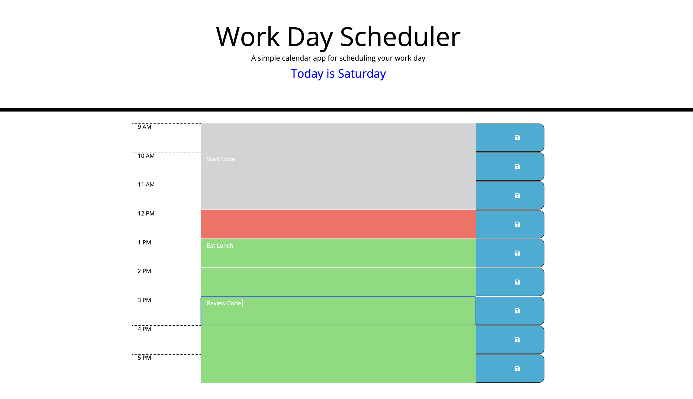

# Daily Calendar Application

## Purpose
This application allows the user to organize their work day by the hour.  The current day is displayed at the top of the page.  Each hour-row will turn a different color depending on if it is past, present, or future.  When text is entered it will be added to local storage and then retrieved when the page is refreshed.

## Built with
*HTML
*CSS
*JavaScript
*JQuery
*Bootstrap
*Moment.js

## Website Link

 https://chrisdhodges12.github.io/daily-calendar/

## Made by Chris Hodges 